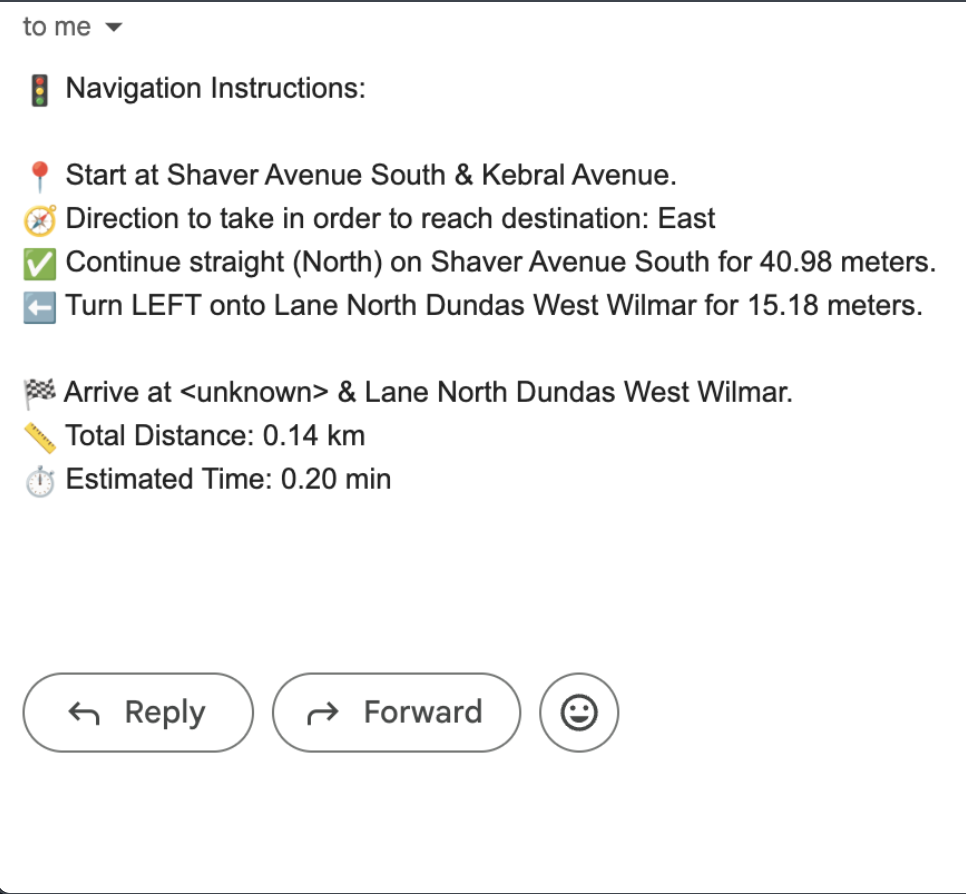

# 📍 Ez-Find Maps – Interactive Map & Route Planner  

An interactive, responsive map application built as part of the University of Toronto’s **ECE297 Software Design & Communication** course.  
Due to **academic confidentiality**, the full source code cannot be published. This repository instead showcases the project’s design, features, and visual demos.  

---

## ✨ Features  

- 🔎 **Smart Search & Autocomplete** – quickly find intersections, addresses, and points of interest.  
- 🗺 **Pathfinding Algorithms** – efficient routing powered by **Dijkstra’s** and **A\*** algorithms.  
- 🎨 **Customizable Map Layers** – night mode + toggleable layers for POIs (cafes, restaurants, landmarks, etc).  
- 📧 **Email Directions Function** – send routes directly to your inbox for **offline access** (no need to rely on screenshots).  
- 🚇 **Transit Integration** – includes **TTC subway and streetcar lines** for multimodal navigation.  

---

## 📸 Key Features  

Here are some examples of the app in action:  

### 1. General View
*Main interactive map with POIs and navigation.*  

  
  

### 2. Light/Dark Mode Toggle
*Customizable night mode for easier viewing.*  

  
  

### 3. Customizable Points of Interest

  
  

### 4. Pre-Saved Maps

  
  

### 4.Path-Finding and Directions

  
  

### 5.Email Directions

  
  

---

## 🔍 Focus  

- **Usability:** Designed for quick and intuitive navigation.  
- **Responsiveness:** Optimized for smooth performance even with large datasets.  
- **Reliability:** Features like the email directions function ensure stress-free use, even in low-connectivity areas (e.g., TTC subway).  

---

## 📌 Technologies Used  

- **C++ & GTK** for core map rendering and GUI.  
- **A\* / Dijkstra** for efficient routing.  
- **Multithreading** for performance optimization.  
- **libcurl (SMTP)** for email integration.  

---

## 📚 Acknowledgements  

Developed as part of **ECE297 – Software Design & Communication** at the University of Toronto.  
